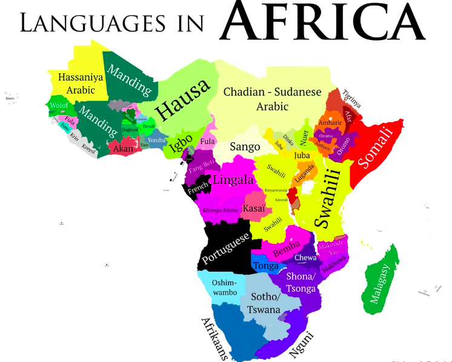

# African language Speech Recognition - Speech-to-Text 

   This project demonstartes how to build speech-to-text deep learning model that process and convert African language((Amharic/Swahili) in to text.
 

## Objective 

to build a deep learning model that is capable of transcribing a speech to text. 

## Data & Features
Dataset for:
    [Amharic](https://github.com/getalp/ALFFA_PUBLIC)
    [Swahili](https://github.com/getalp/ALFFA_PUBLIC)
      
Input features (X): audio clips of spoken words
Target labels (y): a text transcript of what was spoken

## contributors

